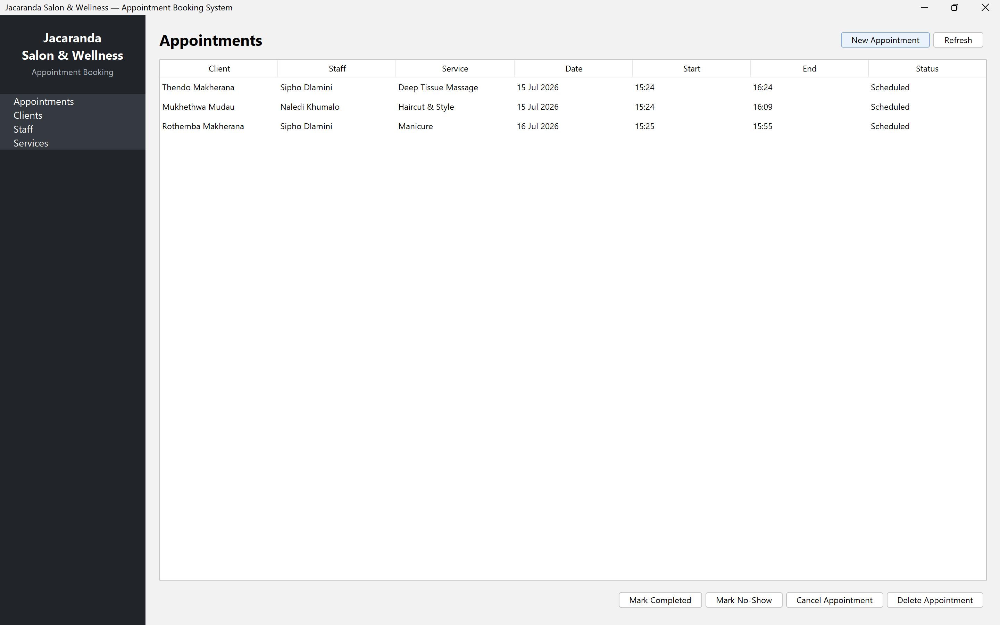
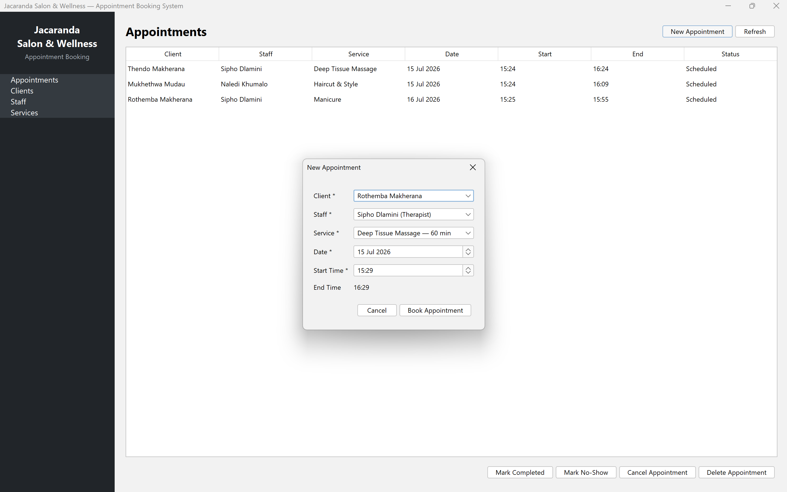
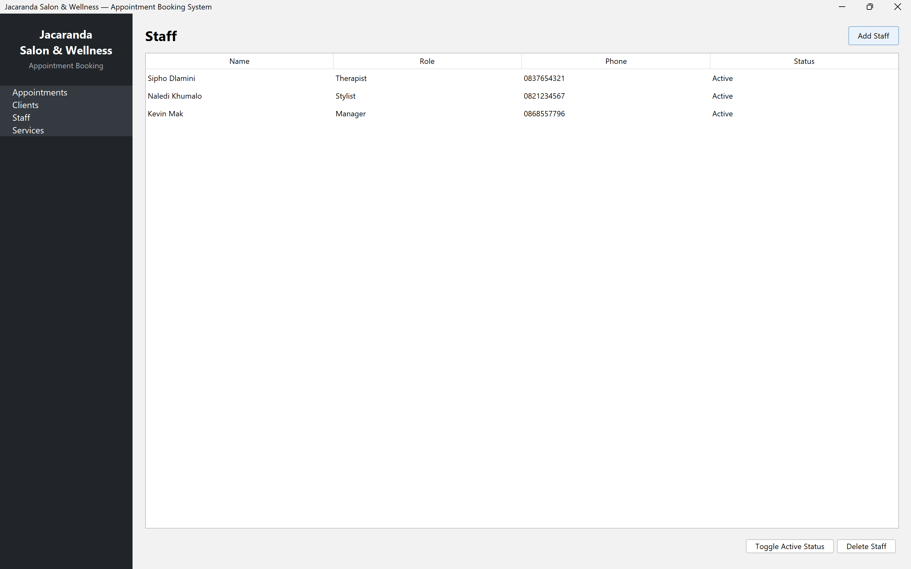

# Jacaranda Salon & Wellness — Appointment Booking System

A desktop application for managing bookings, clients, staff, and services at a small salon and wellness studio, built as a portfolio project demonstrating clean Java desktop application architecture.

## The Problem

Jacaranda Salon & Wellness previously booked appointments using a paper diary and phone calls. This led to double-booked stylists and therapists, lost or illegible client contact details, and no reliable way to track appointment history. AppointmentPro replaces that process with a single system for front-desk staff to manage bookings — with built-in conflict detection so no staff member is ever double-booked.

This is a **staff-facing back-office tool**: clients call or walk in, and front-desk staff use the app to create and manage their bookings.

## Features

- **Appointments** — book, view, complete, cancel, mark as no-show, or delete appointments
- **Automatic conflict detection** — prevents double-booking a staff member for an overlapping time slot
- **Auto-calculated end times** based on the selected service's duration
- **Clients** — add, view, and delete client records
- **Staff** — add staff, toggle active/inactive status, or delete (protected if they have appointment history)
- **Services** — add services with duration and price, or delete (protected if they have appointment history)
- **Data persistence** — all data is stored locally in a SQLite database file, so it survives restarts
- **Input validation** throughout (required fields, valid email/price formats)

## Tech Stack

- **Java 26**
- **Swing** — UI toolkit
- **FlatLaf** — modern flat look and feel for Swing
- **SQLite** (via the `sqlite-jdbc` driver) — embedded, file-based database, no separate server required
- **Maven** — dependency management and build (with `maven-shade-plugin` to produce a standalone runnable JAR)

## Screenshots

## Getting Started

### Prerequisites

- JDK 21 or newer
- Apache Maven (bundled with NetBeans, or install separately)

### Running from source

1. Clone the repository:

git clone https://github.com/KevinMakherana/appointmentpro.git
cd appointmentpro

2. Build and run with Maven:

mvn clean install
java -jar target/AppointmentPro.jar

### Running the prebuilt JAR

If you just want to run the app without building it yourself, download `AppointmentPro.jar` from the [Releases](../../releases) page and run:

java -jar AppointmentPro.jar

No installation or separate database setup is required — the database is created automatically on first run.

## Database

The app uses an embedded **SQLite** database (`data/appointmentpro.db`), created automatically the first time the application runs. The schema and seed data are defined in [`src/main/resources/schema.sql`](src/main/resources/schema.sql), covering four tables: `clients`, `staff`, `services`, and `appointments`, with foreign key constraints and status validation built in.

## Project Structure

src/main/java/com/appointmentpro/
├── app/        # Application entry point
├── db/         # Database connection and schema initialization
├── model/      # Data model records (read-only row types)
├── dao/        # Data access layer (SQL queries, business rules like conflict checking)
└── ui/         # Swing UI: main window, panels, and dialogs

## Future Improvements

- Search/filter appointments by date range or client
- Export appointment history to CSV
- Recurring appointments
- Email/SMS reminders for upcoming bookings

## License

This project is licensed under the MIT License — see the [LICENSE](LICENSE) file for details.